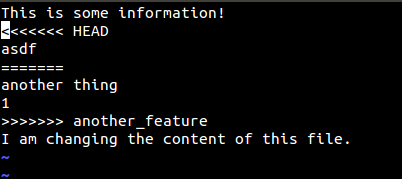
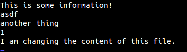

# Resolving Conflicts

Resolving conflicts is important in any Git workflow. It is natural that many people work on the same file and the server has a newer version of that file since the last time you pulled for changes. Sometimes Git tries to apply certain algorithms to see if it can solve the conflict itself, but it often raises a red flag to make sure there is no loss of data.

Here, we did a git pull and we noticed that a conflict arose. Let us see how we can resolve it. A git status shows you what caused the conflict.

We can then open the identified file using a text editor (like jEdit) to see what is wrong. The contents of the file are as shown:

Look at the file carefully. Notice the three lines that have been inserted by Git.

    <<<<<<<< HEAD
    ...
    ...
    ========
    ...
    ...
    >>>>>>>> another_feature

What this means is pretty simple. The lines of code that are between <<<<<<<< HEAD and ======== are a part of your changes, whereas those between ======== and >>>>>>>> another_feature are present in the remote repository that git is trying to merge. What you need to do is remove those three marker lines and edit the content in between them to something that you desire. In our case, let’s keep all the information, so the end file will look something like this.

Although we keep all the content within both blocks, you could remove all content, keep some of the content, or write something else entirely in their place while resolving the conflict.

This conflict was pretty simple in our case. In more complex projects, you might have a lot of instances that lead to conflicts, with a number of instances of the lines shown above included in the conflicting files. The process of solving a rather complex conflict remains the same: Check the affected files through a git status, open each of them, and search for occurrences of HEAD.

After fixing the conflicts, it's time to add, commit, pull (remember to check for any additional conflicts, repeating the process above if necessary), and then push.

Adapted from: [https://www.sitepoint.com/getting-started-git-team-environment/](https://www.sitepoint.com/getting-started-git-team-environment/)
